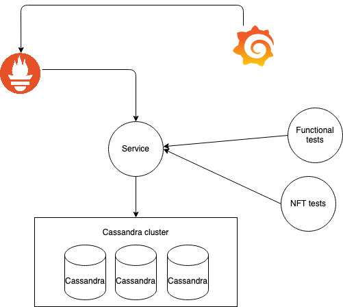

# url-shortner
Implements a microservice to return a short url

## Architecture

This project is organized in different modules. It's self contained and have everything:
- Monitoring (prometheus and grafana)
- Code to handle the url redirects and store the original urls (service)
- Some unit tests within the service
- Functional tests (-functional project)
- NFT tests (-nft project)




### Why cassandra?
Cassandra was picked for this because it operates in active active mode out of the box, does sharding and scales really well, even in a multi DC scenario.

The alternative for this was to use redis if we want to go even faster. The downside of redis is that it is fast while operating in memory. There is a performance penalty if we make it store in disk.
I picked Cassandra as we want to keep the links persistant.

If we want to go faster we can use redis and adopt strategies to mitigate to be lost. For instance, we can have multiple redis nodes in a master slave typology with a Sentinel. 

## Pre requisites (tools)
- java 11 (jdk)
- docker

## How to run
The suggestion to run everything at the same time is to use docker-composer.

First, make sure you build the service (this also runs unit tests):

```
./gradlew :shortner-service:build
```

run docker-compose
```
docker-compose up
```

Once everything is up and running you have the following services running:

- service: http://localhost:8080
- prometheus: http://localhost:9090
- grafana: http://localhost:3000


Save a url on the service:
```
curl --location --request POST 'localhost:8080' \
--header 'Content-Type: application/json' \
--header 'Accept: application/json' \
--data-raw '{
    "url": "www.google.com"
}'
```

The service response will be something like:

```
{"url":"http://localhost:8080/4637494c-375f-4656-b6a9-3944fb1d4a84"}
```


you can get the url:
```
curl --request GET 'http://localhost:8080/08e81acb-8ae7-4af4-b9c3-999c2b799558' --verbose
```

And you will get the following response:
```
*   Trying ::1...
* TCP_NODELAY set
* Connected to localhost (::1) port 8080 (#0)
> GET /08e81acb-8ae7-4af4-b9c3-999c2b799558 HTTP/1.1
> Host: localhost:8080
> User-Agent: curl/7.64.1
> Accept: */*
>
< HTTP/1.1 302 Found
< Date: Wed, 28 Oct 2020 23:24:00 GMT
< Location: http://www.google.com
< Content-Length: 0
<
* Connection #0 to host localhost left intact
* Closing connection 0
```

### Run functional tests
Before you run functional tests, make sure you open grafana: http://localhost:3000/d/xHZj2UpMk/shortner-service-overview
Make sure the board shortner `service overview is opened`

To run functional tests do:
```
./gradlew :shortner-functional:test
```

### Run NFT tests 
Before you run functional tests, make sure you open grafana: http://localhost:3000/d/xHZj2UpMk/shortner-service-overview
Make sure the board shortner `service overview is opened`

To run nft tests do:

```
./gradlew :shortner-nft:runNft
```


NFT tests put some load on the service and assert:
- response times for redirect endpoint (p99 should be faster than 10ms)
- store endpoint should be faster than 500ms
- should have no errors


NFT tests will run for 2 minutes. You can see the service behavior on the grafana link.
After the NFT finishes, you can see more information about NFTs on: `shortner-nft/results`. There will be a folder with an `index.html` file. That file can be opened on a web browser.